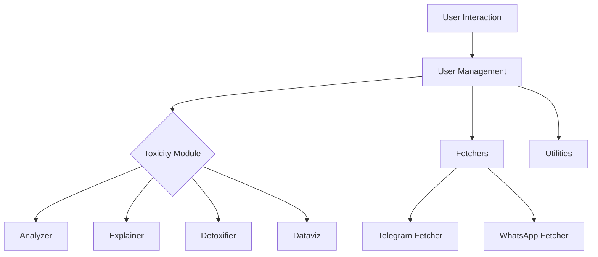
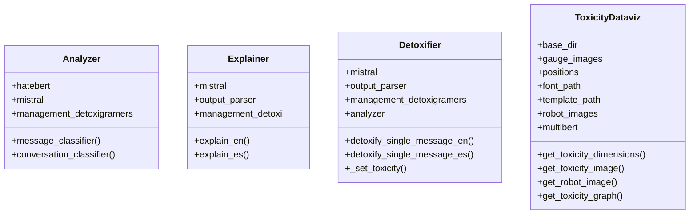
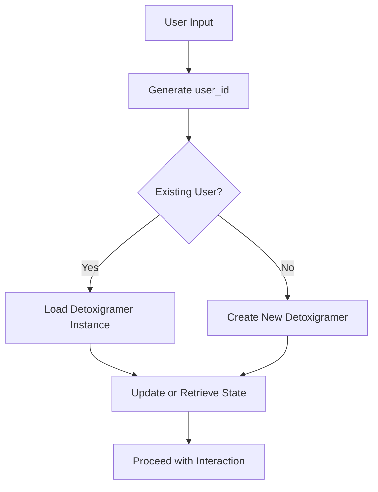
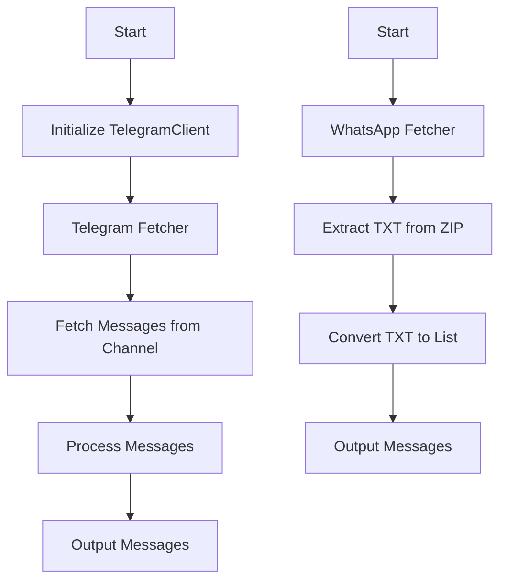

# Detoxigram

Detoxigram is a tool designed to analyze and reduce toxicity in different contexts, combining the strengths of BERT classifiers and generative Language Models (LLMs) to promote healthier online interactions.

## Table of Contents
- [Detoxigram](#detoxigram)
  - [Table of Contents](#table-of-contents)
  - [Overview](#overview)
  - [Installation](#installation)
  - [Project Structure](#project-structure)
  - [Understanding the project](#understanding-the-project)
    - [Toxicity](#toxicity)
      - [Analyzer Module](#analyzer-module)
        - [Key Attributes](#key-attributes)
        - [Methods](#methods)
      - [Explainer Module](#explainer-module)
        - [Key Attributes](#key-attributes-1)
        - [Methods](#methods-1)
      - [Detofixier Module](#detofixier-module)
        - [Key Attributes](#key-attributes-2)
        - [Methods](#methods-2)
      - [Dataviz Module](#dataviz-module)
        - [Key Attributes](#key-attributes-3)
        - [Methods](#methods-3)
      - [User Management](#user-management)
        - [WhatsApp\_Detoxigramer and Telegram\_Detoxigramer Classes](#whatsapp_detoxigramer-and-telegram_detoxigramer-classes)
          - [Key Attributes](#key-attributes-4)
        - [Methods](#methods-4)
      - [ManagementDetoxigramers Class](#managementdetoxigramers-class)
        - [Key Attributes](#key-attributes-5)
        - [Methods](#methods-5)
    - [Fetcher Module](#fetcher-module)
      - [Telegram\_Fetcher Class](#telegram_fetcher-class)
        - [Key Attributes](#key-attributes-6)
        - [Methods](#methods-6)
      - [WhatsApp\_Fetcher Class](#whatsapp_fetcher-class)
        - [Key Attributes](#key-attributes-7)
        - [Methods](#methods-7)
    - [Usage Example](#usage-example)
      - [Utilities Class](#utilities-class)
        - [Key Attributes](#key-attributes-8)
        - [Methods](#methods-8)
    - [User Management and User ID Handling](#user-management-and-user-id-handling)
      - [How to Manage Users](#how-to-manage-users)
        - [Obtaining the `user_id`](#obtaining-the-user_id)
    - [Important Warning](#important-warning)
      - [**Do Not Directly Modify Class Attributes**](#do-not-directly-modify-class-attributes)
      - [**Always Use Provided Methods**](#always-use-provided-methods)
      - [**Why This Matters**](#why-this-matters)
  - [Contributing](#contributing)

## Overview
Inspired by literature (Zhixue et al., 2021; Ousidhoum et al., 2021; Fortuna et al., 2021), Detoxigram identifies and classifies toxic content using a five-level toxicity scale. It leverages BERT models for initial classification and generative LLMs for detailed analysis and detoxification suggestions.

## Installation
1. Clone the repository:
    ```bash
    git clone https://github.com/LIA-DiTella/Detoxigram.git
    cd Detoxigram
    ```
2. Create a virtual environment and activate it:
    ```bash
    python3 -m venv venv
    source venv/bin/activate
    ```
3. Install dependencies:
    ```bash
    pip install -r requirements.txt
    ```
## Project Structure
- `dataset`: Contains datasets for training and evaluation.
- `model_evaluation_scripts`: Scripts for evaluating machine learning models.
- `messager`: Contains the class `messager.py`, which describes the methods for interacting with the user, and `messages.py`which contains the templates for messages.
- `telegram`: main script for telegram bot
- `whatsapp`: main script for whatsapp bot
- `toxicity`: Contains modules for toxicity analysis and management.
  - `Analyzer.py`: Module for analyzing conversations and messages.
  - `Detoxifier.py`: Module for detoxifying content.
  - `Explainer.py`: Module for explaining toxicity classifications.
  - `ToxicityDataviz.py`: Module for visualizing toxicity data.
- `user_management`: Contains modules for managing user data and interactions.
  - `ManagementDetoxigramers.py`: Module for managing Detoxigram users.
  - `Detoxigramer.py`: Module representing a Detoxigram user.
- `requirements.txt`: Python dependencies.
- `test`: Contains test scripts for the project.

## Understanding the project

In order to modularize the project, we have divided the project into different modules. The main modules are:
- `toxicity`
- `user_management`
- `messager`
- `model_evaluation_scripts`

We will explore each of them in detail, so you can use our functions and classes in your own projects : ) (or contribute to ours!)
**Note: go open source!**



### Toxicity
Inside toxicity we have the following modules:
- `Analyzer.py`
- `Detoxifier.py`
- `Explainer.py`
- `Dataviz`-> `ToxicityDataviz.py`



#### Analyzer Module

The `Analyzer` class is designed to evaluate the toxicity of messages and conversations. It utilizes multiple classifiers and manages user states to provide accurate toxicity assessments. Below are the key components and methods of this class:

##### Key Attributes

- **`hatebert`**: An instance of the `hate_bert_classifier`, used to filter and identify the most toxic messages in a conversation.
- **`mistral`**: An instance of the `mistral_classifier`, responsible for predicting the toxicity level of individual messages or entire conversations.
- **`management_detoxigramers`**: An instance of `ManagementDetoxigramers`, which handles the state and data of users involved in the conversations.

##### Methods

- **`message_classifier(message: str) -> int`**:
  - **Description**: This method takes a single message as input and returns its toxicity score. The toxicity score is calculated using the `mistral` classifier.
  - **Parameters**:
    - `message (str)`: The text of the message to be classified.
  - **Returns**:
    - `int`: A numerical toxicity score indicating the severity of the toxicity in the message.

- **`conversation_classifier(user_id: str, conversation_id: str, messages: List[str]) -> int or None`**:
  - **Description**: This method analyzes an entire conversation, calculating the average toxicity score. If the user's state is set to 'NONE', the method updates the user's state and returns the average toxicity score. Otherwise, it returns `None`.
  - **Parameters**:
    - `user_id (str)`: A unique identifier for the user.
    - `conversation_id (str)`: A unique identifier for the conversation.
    - `messages (List[str])`: A list of messages from the conversation.
  - **Returns**:
    - `int`: The average toxicity score of the conversation if the state is 'NONE'.
    - `None`: If the user's state is not 'NONE', no action is taken and `None` is returned.

#### Explainer Module 

The `Explainer` class is designed to provide detailed explanations of why conversations or messages are classified as toxic. It integrates with machine learning models to analyze and explain the toxicity levels in different contexts.

##### Key Attributes

- **`mistral`**: An instance of the `mistral_classifier`, used to predict and explain the toxicity of messages and conversations.
- **`output_parser`**: A parser that processes the output generated by the Mistral model to make it understandable and actionable.
- **`management_detoxi`**: An instance of `ManagementDetoxigramers`, which manages user states and data, ensuring the right context is used for each explanation.

##### Methods

- **`__init__(self, mistral : mistral_classifier, output_parser, management_detoxi: ManagementDetoxigramers)`**:
  - **Description**: Initializes the Explainer class with instances of the mistral classifier, output parser, and user management system.
  - **Parameters**:
    - `mistral`: The classifier used to predict toxicity.
    - `output_parser`: The parser for processing and formatting the explanations.
    - `management_detoxi`: Manages user states and ensures proper context during explanation generation.

- **`explain_en(self, conversation_id: str, user_id: str)`**:
  - **Description**: Provides an explanation in English for why a conversation has been classified as toxic. This method checks the user's state and updates it as necessary before generating the explanation.
  - **Parameters**:
    - `conversation_id (str)`: The ID of the conversation to be explained.
    - `user_id (str)`: The ID of the user requesting the explanation.
  - **Explanation Process**:
    - It retrieves the user's current state and, if not in an active explanation state, updates the state to 'EXPLAIN'.
    - It uses the Mistral model to generate an explanation based on the conversation's toxicity level and the provided messages.

- **`explain_es(self, conversation_id: str, user_id: str)`**:
  - **Description**: Provides an explanation in Spanish for why a conversation has been classified as toxic, following a similar process to `explain_en` but using a toxicity scale and explanations appropriate for the Spanish language.
  - **Parameters**:
    - `conversation_id (str)`: The ID of the conversation to be explained.
    - `user_id (str)`: The ID of the user requesting the explanation.
  - **Explanation Process**:
    - Retrieves the user's state and updates it if necessary.
    - Generates an explanation using the Mistral model, specifically tailored to Spanish language contexts and the predefined toxicity scale.

- **Refactoring Note**: It is recommended to isolate direct interactions with the LLM (Language Learning Model) within the corresponding instance (e.g., Mistral). This would improve modularity and maintainability of the class.

#### Detofixier Module

The `Detoxifier` class is responsible for analyzing and detoxifying messages in different languages (English and Spanish). It utilizes machine learning models to classify the toxicity of messages and provides non-toxic alternatives.

##### Key Attributes

- **`mistral`**: An instance of the `mistral_classifier`, used to predict toxicity levels of messages.
- **`output_parser`**: A parser that processes the output generated by the Mistral model.
- **`management_detoxigramers`**: An instance of `ManagementDetoxigramers`, responsible for managing the states and data of users.
- **`analyzer`**: An instance of the `Analyzer` class, used for classifying the toxicity of messages.

##### Methods

- **`__init__(self, mistral: mistral_classifier, output_parser, management_detoxigramers: ManagementDetoxigramers, analyzer: Analyzer)`**:
  - **Description**: Initializes the Detoxifier class with instances of the mistral classifier, output parser, management system for users, and the analyzer.
  - **Parameters**:
    - `mistral`: The classifier used for predicting toxicity.
    - `output_parser`: The parser used to format and interpret the model's output.
    - `management_detoxigramers`: Manages user data and states.
    - `analyzer`: Classifies the toxicity of messages.

- **`detoxify_single_message_en(self, message: str, user_id: str)`**:
  - **Description**: Detoxifies a single message in English. The method classifies the toxicity of the message and, if necessary, generates a non-toxic alternative.
  - **Parameters**:
    - `message (str)`: The message to be detoxified.
    - `user_id (str)`: The unique identifier of the user.
  - **Returns**:
    - `output`: The detoxified version of the message if it's found to be toxic.

- **`detoxify_single_message_es(self, message: str, user_id: str)`**:
  - **Description**: Detoxifies a single message in Spanish (Rioplatense). Similar to the English version, this method classifies the toxicity of the message and generates a non-toxic alternative if needed.
  - **Parameters**:
    - `message (str)`: The message to be detoxified.
    - `user_id (str)`: The unique identifier of the user.
  - **Returns**:
    - `output`: The detoxified version of the message if it's found to be toxic.

- **`_set_toxicity(self, classification: int, language: Literal['EN', 'ES'])`**:
  - **Description**: Determines the toxicity level of a message based on its classification score and language. This method is used internally by the `detoxify_single_message_en` and `detoxify_single_message_es` methods.
  - **Parameters**:
    - `classification (int)`: The classification score of the message.
    - `language (Literal['EN', 'ES'])`: The language of the message ('EN' for English, 'ES' for Spanish).
  - **Returns**:
    - `toxicity`: A string representing the toxicity level.

#### Dataviz Module

The `ToxicityDataviz` class provides tools for visualizing the toxicity levels across different dimensions (sarcastic, antagonizing, stereotyping, dismissive) of a conversation. It leverages the `multi_bert_classifier` to analyze the conversation and generate a graphical representation of the results.

##### Key Attributes

- **`base_dir`**: The base directory path where image templates and fonts are stored.
- **`gauge_images`**: A dictionary mapping toxicity dimensions and levels to corresponding gauge image filenames.
- **`positions`**: A list of coordinates where each toxicity gauge will be placed on the final image.
- **`font_path`**: The file path to the font used for adding text to the images.
- **`template_path`**: The file path to the base template image used as a background for the visualization.
- **`robot_images`**: A dictionary mapping overall toxicity levels to corresponding robot image filenames.
- **`multibert`**: An instance of the `multi_bert_classifier` used to get the toxicity distribution of a conversation.

##### Methods

- **`__init__(self, multibert: multi_bert_classifier)`**:
  - **Description**: Initializes the ToxicityDataviz class with the necessary paths, image mappings, and the multi-BERT classifier.
  - **Parameters**:
    - `multibert`: An instance of the `multi_bert_classifier`, used to analyze conversation toxicity.

- **`get_toxicity_dimensions(self, conversation: str, conversation_name: str, toxicity: int)`**:
  - **Description**: Analyzes a conversation to get the toxicity distribution across different dimensions and generates a corresponding visualization.
  - **Parameters**:
    - `conversation (str)`: The conversation text to be analyzed.
    - `conversation_name (str)`: The name of the conversation, which will be displayed on the visualization.
    - `toxicity (int)`: The overall toxicity score of the conversation.
  - **Returns**:
    - The file path to the generated image.

- **`get_toxicity_image(self, toxicity_level: float, dimension: str)`**:
  - **Description**: Retrieves the appropriate gauge image based on the toxicity level and dimension.
  - **Parameters**:
    - `toxicity_level (float)`: The toxicity score for a specific dimension.
    - `dimension (str)`: The dimension being visualized (e.g., 'sarcastic', 'antagonizing').
  - **Returns**:
    - The file path to the appropriate gauge image.

- **`get_robot_image(self, toxicity_vector: List[float], toxicity: int)`**:
  - **Description**: Selects the robot image to be displayed based on the overall toxicity level.
  - **Parameters**:
    - `toxicity_vector (List[float])`: The toxicity distribution across different dimensions.
    - `toxicity (int)`: The overall toxicity score of the conversation.
  - **Returns**:
    - The file path to the selected robot image.

- **`get_toxicity_graph(self, channel_name: str, toxicity_vector: List[float], toxicity: int)`**:
  - **Description**: Generates the final toxicity visualization image, including the channel name, toxicity gauges for each dimension, and a robot image indicating the overall toxicity.
  - **Parameters**:
    - `channel_name (str)`: The name of the conversation or channel.
    - `toxicity_vector (List[float])`: The toxicity distribution across different dimensions.
    - `toxicity (int)`: The overall toxicity score of the conversation.
  - **Returns**:
    - The file path to the generated image.
  - **Error Handling**:
    - Prints an error message if any issues occur during the image generation process.

#### User Management

##### WhatsApp_Detoxigramer and Telegram_Detoxigramer Classes

These classes represent users interacting with the system on WhatsApp and Telegram platforms, respectively. They manage user states, track conversations, and handle platform-specific operations related to analyzing and detoxifying conversations.

###### Key Attributes

- **`id`**: A unique identifier for each user, represented as a string. It is generated by hashing the user's number.
- **`status`**: Represents the current feature or operation the user is engaged in, such as 'DETOX', 'ANALYZE', 'EXPLAIN', or 'DISTRIBUTION'.
- **`conversation_classification`**: An optional tuple containing the name of the conversation/channel being analyzed and its toxicity classification.
- **`messages_per_conversation`**: A dictionary where keys are conversation IDs and values are lists of messages from those conversations.
- **`explanation`**: An optional string that contains explanations related to the toxicity of conversations.
- **`testing`**: A boolean flag indicating whether the testing mode is active.
- **`platform`**: A tuple indicating the availability of the platforms (Telegram, WhatsApp) for the user.

##### Methods

- **`__init__(self)`**:
  - **Description**: Initializes the user object with default attributes, preparing it for interaction with the WhatsApp or Telegram platform.

- **`set_id(self, number: int)`**:
  - **Description**: Sets the user's ID by hashing their number with SHAKE-256.
  - **Parameters**:
    - `number (int)`: The user's number used to generate a unique ID.

- **`_last_toxicity(self, classification: int, language: Literal['EN', 'ES'])`**:
  - **Description**: Converts a toxicity classification score into a human-readable label based on the specified language (English or Spanish).
  - **Parameters**:
    - `classification (int)`: The numeric toxicity classification score.
    - `language (Literal['EN', 'ES'])`: The language in which to return the toxicity label.
  - **Returns**:
    - A string representing the toxicity level.

- **`_update_conversation(self, conversation_id: str, classification: int, messages: List[str], language: Literal['EN', 'ES'])`**:
  - **Description**: Updates the conversation classification and stores the related messages.
  - **Parameters**:
    - `conversation_id (str)`: The ID of the conversation being updated.
    - `classification (int)`: The toxicity classification score of the conversation.
    - `messages (List[str])`: A list of messages from the conversation.
    - `language (Literal['EN', 'ES'])`: The language used in the conversation.

- **`_set_platform(self, platform: str)`**:
  - **Description**: Sets the user's platform based on the input ('TELEGRAM' or 'WHATSAPP').
  - **Parameters**:
    - `platform (str)`: The platform identifier.

- **`_set_status(self, status: Literal['DETOX', 'ANALYZE', 'EXPLAIN', 'DISTRIBUTION'])`**:
  - **Description**: Sets the current status of the user.
  - **Parameters**:
    - `status (Literal['DETOX', 'ANALYZE', 'EXPLAIN', 'DISTRIBUTION'])`: The new status to be set.

- **`get_id(self) -> int`**:
  - **Description**: Returns the user's unique identifier.
  - **Returns**:
    - `int`: The user's ID.

- **`get_status(self) -> Literal['DETOX', 'ANALYZE', 'EXPLAIN', 'DISTRIBUTION']`**:
  - **Description**: Returns the current status of the user.
  - **Returns**:
    - `Literal['DETOX', 'ANALYZE', 'EXPLAIN', 'DISTRIBUTION']`: The user's current status.

- **`get_conversation_classification(self) -> Tuple[str, str]`**:
  - **Description**: Returns the classification of the last analyzed conversation.
  - **Returns**:
    - `Tuple[str, str]`: The name of the conversation and its classification.

- **`get_messages_conversation(self, conversation_id: str) -> List[str]`**:
  - **Description**: Retrieves the messages from a specified conversation.
  - **Parameters**:
    - `conversation_id (str)`: The ID of the conversation from which to retrieve messages.
  - **Returns**:
    - `List[str]`: A list of messages from the specified conversation.

#### ManagementDetoxigramers Class

The `ManagementDetoxigramers` class manages multiple instances of `Detoxigramer`, which represent individual users' states and data. This class provides methods to retrieve, set, reset, and remove `Detoxigramer` instances based on user IDs.



##### Key Attributes

- **`detoxigramers`**: A dictionary where the keys are user IDs (strings) and the values are instances of `Detoxigramer`. This dictionary holds the state of all users interacting with the system.

##### Methods

- **`__init__(self)`**:
  - **Description**: Initializes the `ManagementDetoxigramers` class by setting up an empty dictionary to store `Detoxigramer` instances.

- **`get_detoxigramer(self, user_id: str) -> Detoxigramer`**:
  - **Description**: Retrieves the `Detoxigramer` instance for the given user ID. If no instance exists for that ID, a new `Detoxigramer` is created, assigned the given ID, and stored.
  - **Parameters**:
    - `user_id (str)`: The unique identifier of the user.
  - **Returns**:
    - `Detoxigramer`: The `Detoxigramer` instance associated with the given user ID.

- **`set_detoxigramer(self, user_id: str, detoxigramer: Detoxigramer)`**:
  - **Description**: Sets or updates the `Detoxigramer` instance for the specified user ID.
  - **Parameters**:
    - `user_id (str)`: The unique identifier of the user.
    - `detoxigramer (Detoxigramer)`: The `Detoxigramer` instance to be associated with the user ID.

- **`reset_detoxigramer(self, user_id: str)`**:
  - **Description**: Resets the `Detoxigramer` instance for the specified user ID, effectively creating a new `Detoxigramer` and reassigning the same user ID.
  - **Parameters**:
    - `user_id (str)`: The unique identifier of the user.

- **`get_all_detoxigramers(self) -> List[Detoxigramer]`**:
  - **Description**: Returns a list of all `Detoxigramer` instances currently managed by the class.
  - **Returns**:
    - `List[Detoxigramer]`: A list of all `Detoxigramer` instances.

- **`remove_detoxigramer(self, user_id: str)`**:
  - **Description**: Removes the `Detoxigramer` instance associated with the specified user ID from the management dictionary.
  - **Parameters**:
    - `user_id (str)`: The unique identifier of the user.

**@REFACTOR**: Pending implementation of database integration and connection to Django for persistent storage of `Detoxigramer` instances.

### Fetcher Module




#### Telegram_Fetcher Class

The `Telegram_Fetcher` class is responsible for fetching messages from a specified Telegram channel. It interacts with the Telegram API using the `Telethon` library.

##### Key Attributes

- **`client`**: An instance of `TelegramClient` that is used to interact with the Telegram API.

##### Methods

- **`__init__(self, client: TelegramClient)`**:
  - **Description**: Initializes the `Telegram_Fetcher` class with a `TelegramClient` instance.
  - **Parameters**:
    - `client (TelegramClient)`: The client instance used to interact with Telegram.

- **`fetch(self, channel_name: str) -> List[str]`**:
  - **Description**: Asynchronously fetches the latest messages from a specified Telegram channel.
  - **Parameters**:
    - `channel_name (str)`: The name of the Telegram channel from which to fetch messages.
  - **Returns**:
    - `List[str]`: A list of messages fetched from the specified Telegram channel.
  - **Error Handling**:
    - Catches and prints any exceptions that occur during the message fetching process.

#### WhatsApp_Fetcher Class

The `WhatsApp_Fetcher` class is designed to extract and process text messages from WhatsApp conversation archives provided in ZIP format.

##### Key Attributes

- **`zip_path`**: The path to the ZIP file containing WhatsApp messages.
- **`extract_to`**: The directory where extracted files will be temporarily stored.

##### Methods

- **`extract_txt_from_zip(self, zip_path: str, extract_to: str) -> str`**:
  - **Description**: Extracts a `.txt` file containing WhatsApp messages from a ZIP archive.
  - **Parameters**:
    - `zip_path (str)`: The path to the ZIP file.
    - `extract_to (str)`: The directory where the `.txt` file will be extracted.
  - **Returns**:
    - `str`: The path to the extracted `.txt` file, or `None` if no such file is found.

- **`txt_to_list(self, archivo: str) -> List[str]`**:
  - **Description**: Converts the extracted WhatsApp messages from the `.txt` file into a list of formatted strings.
  - **Parameters**:
    - `archivo (str)`: The path to the `.txt` file containing WhatsApp messages.
  - **Returns**:
    - `List[str]`: A list of formatted messages extracted from the `.txt` file.

- **`fetch(self, archivo: str) -> List[str]`**:
  - **Description**: Orchestrates the extraction and processing of WhatsApp messages from a ZIP file, returning them as a list of strings.
  - **Parameters**:
    - `archivo (str)`: The path to the ZIP file containing WhatsApp messages.
  - **Returns**:
    - `List[str]`: A list of formatted WhatsApp messages.
  - **Error Handling**:
    - Raises a `FileNotFoundError` if no `.txt` file is found in the ZIP archive.

### Usage Example

To use these classes, you first need to instantiate a `TelegramClient` for the `Telegram_Fetcher`, and then call the `fetch` method to retrieve messages from a specified channel. For `WhatsApp_Fetcher`, provide the path to a ZIP file containing WhatsApp messages, and use the `fetch` method to extract and process those messages.

```python
client = TelegramClient(sessions.MemorySession(), API_ID_TELEGRAM, API_HASH_TELEGRAM)
telegram = Telegram_Fetcher(client)
messages = asyncio.run(telegram.fetch('@ChannelName'))
print(messages)

whatsapp_fetcher = WhatsApp_Fetcher()
messages = whatsapp_fetcher.fetch('path_to_zip_file.zip')
print(messages)
```

#### Utilities Class

The `Utilities` class provides several data processing operations, including language detection, greeting detection, and handling Telegram messages. It leverages models from Hugging Face and FastText for these tasks.

##### Key Attributes

- **`model_language`**: A FastText model used for detecting the language of a given message. It is loaded from Hugging Face's model repository.
- **`model_name`**: The name of the Hugging Face model used for greeting detection.
- **`classifier`**: A Hugging Face pipeline for text classification, specifically used for detecting greetings in messages.

##### Methods

- **`__init__(self)`**:
  - **Description**: Initializes the `Utilities` class by loading the necessary language detection and greeting detection models.
  - **Key Operations**:
    - Loads a FastText model for language detection.
    - Initializes a Hugging Face pipeline for greeting detection using a specified model.

- **`language_detection(self, message: str) -> Literal['EN', 'ES']`**:
  - **Description**: Detects the language of a given message.
  - **Parameters**:
    - `message (str)`: The message to be analyzed.
  - **Returns**:
    - `'EN'`: If the message is detected to be in English.
    - `'ES'`: If the message is detected to be in Spanish.
    - `'UNKNOWN'`: If the language cannot be determined as either English or Spanish.

- **`greeting_detection(self, message: str) -> Literal['GREETING', 'NONE']`**:
  - **Description**: Detects whether a given message is a greeting.
  - **Parameters**:
    - `message (str)`: The message to be analyzed.
  - **Returns**:
    - `'GREETING'`: If the message is classified as a greeting.
    - `'NONE'`: If the message is not classified as a greeting.

### How to initialize WhatsApp Bot

Remember to create a local `.env` file with the environment variables!

## Stack
- PyWa
- Serveo

## Activating Serveo
We are using [Serveo](https://serveo.net/) to create the SSH tunnel. To activate the tunnel, run the following command:

```bash
ssh -R detoxigram.serveo.net:80:localhost:8080 serveo.net
```

To configure this properly, it was more complicated than just running the command. Here’s what I had to do:

1. **Create an SSH public key:**

```bash
ssh-keygen -t rsa -b 4096 -C "detoxi_id"
```

Then, you will see the following in the terminal:

```bash
Generating public/private rsa key pair.
Enter file in which to save the key (/Users/luzalbaposse/.ssh/id_rsa): -> press enter here
Enter passphrase (empty for no passphrase): -> enter a passphrase
Enter same passphrase again: -> re-enter the passphrase
Your identification has been saved in /Users/luzalbaposse/.ssh/id_rsa
Your public key has been saved in /Users/luzalbaposse/.ssh/id_rsa.pub
The key fingerprint is:
SHA256:CUgCadkC/zwNlTFM1cFMz5nR6ej7vZLJSWUzhsJ+zl4 detoxi_id
The key's randomart image is: ...
```

2. **Run the following command:**

```bash
ssh -i ~/.ssh/id_rsa -R detoxigram.serveo.net:80:localhost:8080 serveo.net
```

This will require you to sign in with Google and provide a link to verify your account.

3. **Close the tunnel and restart it:**

If there are errors, check that Uvicorn is running on port 8080 and that the tunnel is configured correctly.
-> If you see a `Get [...] challenge 200 OK`, it’s working fine. : )

To start the servers:

```bash
uvicorn wa:fastapi_app --host 0.0.0.0 --port 8080
ssh -i ~/.ssh/id_rsa -R detoxigram.serveo.net:80:localhost:8080 serveo.net
```

Run Serveo first, and then Uvicorn.

### User Management and User ID Handling

The system manages users through the `ManagementDetoxigramers` class, which maintains instances of `Detoxigramer` for each user. The `user_id` is a crucial element used to uniquely identify and manage user states across different interactions.

#### How to Manage Users

User management in the system involves updating and retrieving user states, which are encapsulated within `Detoxigramer` instances. Here’s how you can manage users:

1. **Updating User State**:
   - To update the state of a user, first, obtain the `Detoxigramer` instance using the `get_detoxigramer(user_id: str)` method from the `ManagementDetoxigramers` class. This instance holds the user's current state and can be modified as needed.
   - Example:
     ```python
     management = ManagementDetoxigramers()
     detoxigramer = management.get_detoxigramer(user_id)
     detoxigramer._set_status('ANALYZE')
     ```

2. **Resetting User State**:
   - To reset a user’s state, use the `reset_detoxigramer(user_id: str)` method. This will create a new `Detoxigramer` instance for the user, effectively resetting their state.
   - Example:
     ```python
     management.reset_detoxigramer(user_id)
     ```

3. **Removing a User**:
   - If you need to remove a user entirely, use the `remove_detoxigramer(user_id: str)` method. This will delete the user’s `Detoxigramer` instance from the management dictionary.
   - Example:
     ```python
     management.remove_detoxigramer(user_id)
     ```

4. **Retrieving All Users**:
   - To retrieve all users, use the `get_all_detoxigramers()` method. This returns a list of all `Detoxigramer` instances currently managed.
   - Example:
     ```python
     all_users = management.get_all_detoxigramers()
     ```

##### Obtaining the `user_id`

The `user_id` is obtained from the user's WhatsApp ID (`wa-id`) or phone number, which is hashed to ensure uniqueness and security. This hashed `user_id` is used consistently across all interactions and stored in the `Detoxigramer` instance for each user.

- **Hashing Process**:
  - The `user_id` is generated by hashing the user's phone number or `wa-id` using the SHAKE-256 hashing algorithm. This ensures a unique and secure identifier for each user.
  - Example:
    ```python
    import hashlib

    def generate_user_id(phone_number: int) -> str:
        hash_object = hashlib.shake_256(str(phone_number).encode())
        return hash_object.hexdigest(15)
    ```

- **Where it is Used**:
  - The `user_id` is used across different classes to manage and update the user's state, retrieve conversation history, and track interactions within the system.

By following this structure, you can effectively manage users and their states, ensuring that interactions are correctly logged and processed. The secure handling of `user_id` ensures that user data is kept safe while allowing for consistent identification across sessions.

### Important Warning

#### **Do Not Directly Modify Class Attributes**

It is crucial to **never directly modify** the attributes of classes like `Detoxigramer`, `ManagementDetoxigramers`, `Telegram_Fetcher`, or `WhatsApp_Fetcher`. Direct modification can lead to inconsistent states, unexpected behavior, and difficult-to-trace bugs.

#### **Always Use Provided Methods**

To ensure consistency and maintain the integrity of user data and system operations, **always use the provided methods** to update or retrieve information. These methods are designed to enforce invariants, handle errors, and manage state transitions correctly.

For example:

- To update a user's status, use the `_set_status(status: Literal['DETOX', 'ANALYZE', 'EXPLAIN', 'DISTRIBUTION'])` method instead of directly changing the `status` attribute.
- To reset or modify user data, use the methods like `reset_detoxigramer(user_id: str)` or `set_detoxigramer(user_id: str, detoxigramer: Detoxigramer)` in the `ManagementDetoxigramers` class.

#### **Why This Matters**

Directly modifying class attributes bypasses important logic embedded in these methods, which can lead to:

- **Inconsistent Data**: Data integrity issues where different parts of the system have conflicting information.
- **Security Risks**: Directly modifying attributes can introduce vulnerabilities, especially in managing user IDs and states.
- **Maintenance Challenges**: Makes the codebase harder to maintain, debug, and extend in the future.

**Always follow the proper methods for updating and managing user data and system states to ensure the system runs reliably and securely.**


## Contributing
1. Fork the repository.
2. Create a new branch (`git checkout -b feature/YourFeature`).
3. Commit your changes (`git commit -am 'Add a new feature'`).
4. Push to the branch (`git push origin feature/YourFeature`).
5. Create a new Pull Request.
